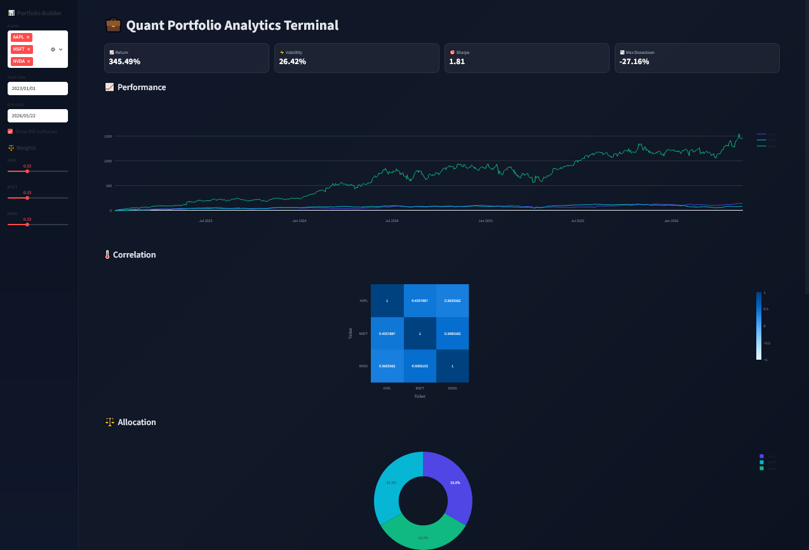

# 💼 Portfolio Analytics Terminal

Quantitative portfolio analytics dashboard built with Python.

## 📊 Overview

This project is a **financial analytics terminal** designed to analyze multi-asset portfolios using modern quantitative methods.

It includes:

- Portfolio performance analysis
- Risk metrics (volatility, Sharpe ratio, drawdown)
- Correlation analysis
- Monte Carlo simulation
- Portfolio optimization (Markowitz mean-variance optimization)
- Interactive dashboard built with Streamlit

---

## 🧠 Methods & Models

The system implements standard quantitative finance techniques:

- **Mean-Variance Optimization (Markowitz framework)**
- **Sharpe ratio maximization**
- **Monte Carlo simulation for price paths**
- **Risk-adjusted performance metrics**
- **Rolling return analysis**

---

## 📊 Features

### Portfolio Analysis
- Custom asset selection (stocks & crypto via Yahoo Finance)
- Adjustable portfolio weights
- Dynamic time window selection

### Risk Metrics
- Annualized volatility
- Sharpe ratio
- Maximum drawdown

### Visual Analytics
- Cumulative returns
- Correlation heatmap
- Allocation pie chart
- Drawdown curve

### Optimization Module
- Efficient portfolio allocation
- Optimal Sharpe-weighted portfolio

---
## 📷 Dashboard Preview



--
# 💼 Quantitative Portfolio Analytics System

👉 🌐 Live App: [Open Dashboard](https://financialdashboard-5qmm6wasm28oemyybptqww.streamlit.app/))

## 🛠️ Tech Stack

- Python 3.9+
- Streamlit
- Pandas
- NumPy
- Plotly
- SciPy
- yFinance

---

## 🚀 How to Run

```bash
pip install -r requirements.txt
streamlit run app.py

